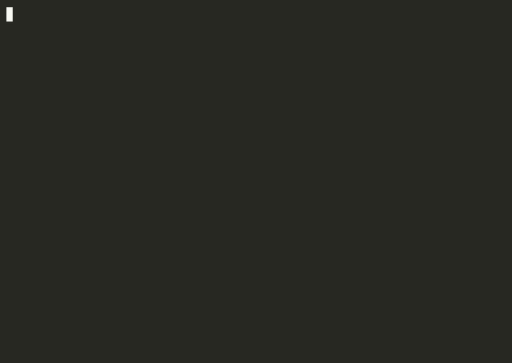

# SingCoach




> iOS vocal coaching app that records a singing clip with `AVAudioRecorder`, runs on-device pitch detection via normalized autocorrelation and vDSP, then sends the extracted metrics to Claude for a structured 0–100 score with specific improvement steps — no audio ever leaves the device during analysis.

## Features

- **On-device pitch detection:** `VocalAnalyzer` extracts fundamental frequency frame-by-frame using normalized autocorrelation with a Hann window applied via `vDSP_hann_window` and `vDSP_vmul`. Lag search is bounded to 80–1100 Hz, and frames below an RMS threshold of `5e-4` are excluded as unvoiced.
- **vDSP-accelerated dynamics:** Mean loudness is computed with `vDSP_rmsqv` across the full sample buffer; dynamic range is derived by chunking into 100ms windows, computing per-chunk RMS dB, then using `vDSP_maxv`/`vDSP_minv` for peak-to-floor difference.
- **Spectral centroid via FFT:** `vDSP_create_fftsetup` with `kFFTRadix2` transforms an even/odd-packed real signal; `vDSP_zvabs` computes per-bin magnitudes, and the centroid is the frequency-weighted mean of all magnitude bins.
- **Pitch stability metric:** After collecting pitched frames, `vDSP_meanv` and `vDSP_vsq` compute mean and variance; stability is expressed as `1 − σ/μ`, giving a 0–1 score that penalizes wavering pitch proportionally.
- **AVAudioRecorder with metering:** `VocalRecorder` configures the session with `.playAndRecord` / `.measurement` mode, records Apple Lossless at 44.1 kHz mono, and polls `averagePower(forChannel:)` at 50ms intervals via a `Timer` to drive a real-time level meter in SwiftUI.
- **Claude API integration:** `ClaudeClient` posts a structured prompt containing the six extracted metrics to `claude-sonnet-4-6` and parses the response — enforced as bare JSON — into a `CoachingResult` with score, highlights, and improvement steps.
- **SwiftUI reactive UI:** `VocalRecorder` is a `@MainActor ObservableObject`; `@Published` properties (`isRecording`, `levelDB`, `elapsedSeconds`) drive all view transitions without manual state synchronization. The level meter pulse scales the mic circle by up to 25% based on normalized dB.

## Analysis Pipeline

| Metric | Method |
|---|---|
| Pitch (Hz) | Normalized autocorrelation, Hann-windowed 2048-sample frames, 512-sample hop |
| Pitch stability | `1 − σ/μ` over all voiced frames via `vDSP_meanv` / `vDSP_vsq` |
| Voiced ratio | Fraction of frames exceeding RMS threshold of `5e-4` |
| Mean loudness | `vDSP_rmsqv` → 20·log10 over full buffer |
| Dynamic range | `vDSP_maxv − vDSP_minv` across 100ms RMS chunks |
| Spectral centroid | Radix-2 FFT via even/odd packing, `vDSP_zvabs` magnitude, frequency-weighted mean |

## Tech Stack

| Layer | Technology |
|---|---|
| Language | Swift 5.9 |
| UI | SwiftUI, `@Published` / `ObservableObject` |
| Audio capture | AVFoundation (`AVAudioRecorder`, `AVAudioSession`) |
| Audio analysis | Accelerate (`vDSP_dotpr`, `vDSP_hann_window`, `vDSP_fft_zip`, `vDSP_zvabs`) |
| Networking | URLSession async/await |
| AI feedback | Anthropic Messages API (`claude-sonnet-4-6`) |
| Persistence | UserDefaults (API key storage) |
| Build | XcodeGen (`project.yml`) |

## Architecture

Three-layer service architecture beneath a SwiftUI view hierarchy. `VocalRecorder` handles capture and publishes live meter state. `VocalAnalyzer` is a pure value-type `struct` — stateless, `async`, takes a file URL and returns a `VocalAnalysis` value. `ClaudeClient` is also a stateless struct that takes a `VocalAnalysis` and returns a `CoachingResult`. Views never talk to services directly; `HomeView` coordinates the pipeline by awaiting each stage in sequence.

## Key Implementation

**Autocorrelation pitch detection:** Each 2048-sample frame is Hann-windowed to reduce spectral leakage, then `vDSP_dotpr` computes the zero-lag energy `r0` and iterates lags from `sr/1100` to `sr/80` samples. The lag with the highest normalized correlation (`r / r0 > 0.45`) gives the fundamental period; `f0 = sr / bestLag`.

**Even/odd FFT packing:** The spectral centroid FFT avoids allocating a full complex buffer by packing even-indexed samples into the real part and odd-indexed into the imaginary part of a half-size `DSPSplitComplex`, exploiting the real-signal symmetry property of `vDSP_fft_zip`.

**Structured JSON enforcement:** The Claude prompt explicitly states "Respond ONLY with valid JSON and no markdown fences" and the system prompt reinforces it. `parseCoaching` strips any residual fences before `JSONDecoder` runs, with a deterministic fallback result if parsing fails rather than propagating an error to the user.

## Setup

Requirements: Xcode 15+, iOS 16+, an [Anthropic API key](https://console.anthropic.com).

```bash
brew install xcodegen
git clone https://github.com/gerardrecinto/singing-coach-ios.git
cd singing-coach-ios
xcodegen generate
open SingCoach.xcodeproj
```

In the app, tap the gear icon and paste your `sk-ant-...` key. It is stored in `UserDefaults` on-device and sent only to `api.anthropic.com`.

## Project Layout

```
Sources/
├── App/SingCoachApp.swift          @main entry, injects API key from UserDefaults
├── Views/
│   ├── HomeView.swift              Coordinates record → analyze → coach pipeline
│   ├── RecordingView.swift         Mic UI, real-time level meter, elapsed timer
│   ├── ResultView.swift            Score gauge, strengths list, improvement steps
│   └── SettingsView.swift          API key input and persistence
├── Services/
│   ├── VocalRecorder.swift         AVAudioRecorder wrapper, 50ms metering timer
│   ├── VocalAnalyzer.swift         Pitch, dynamics, spectral analysis via vDSP
│   └── ClaudeClient.swift          Anthropic API call, JSON parsing, fallback
└── Models/Models.swift             VocalAnalysis, CoachingResult, AppError
project.yml                         XcodeGen project spec
```
